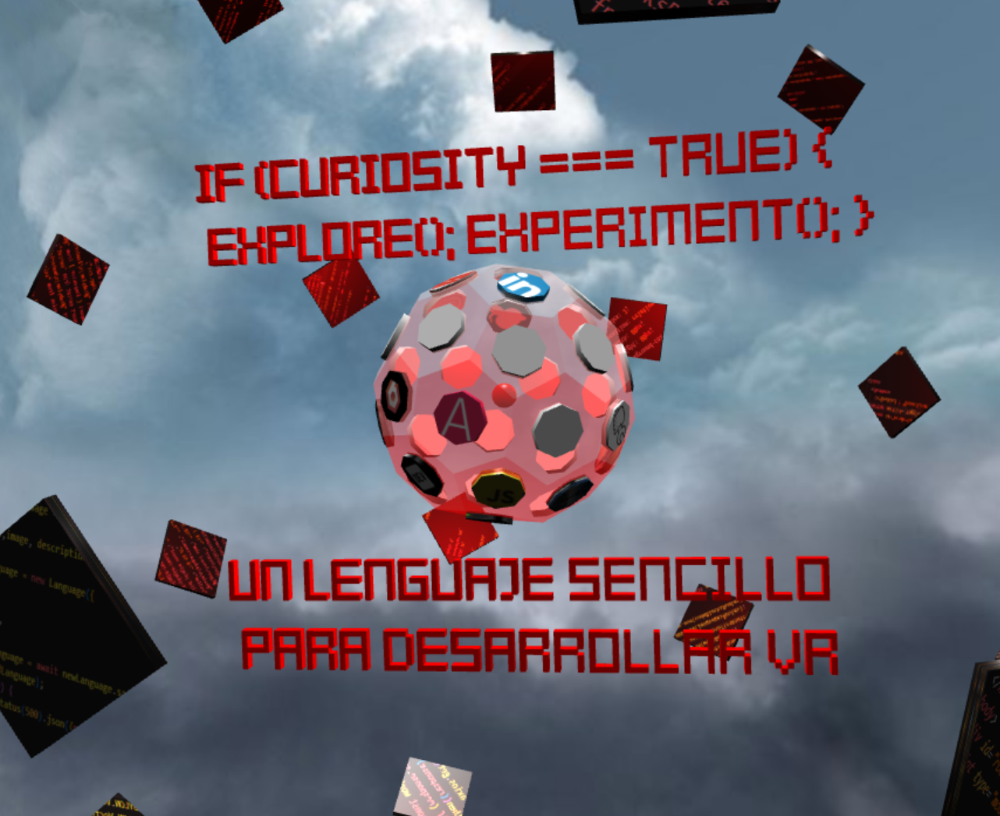
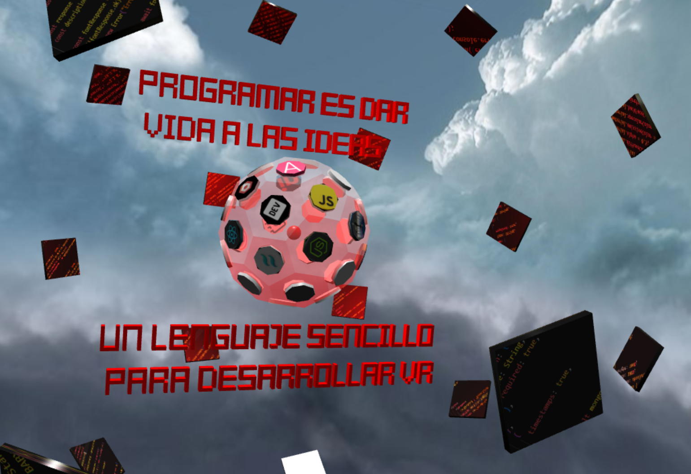
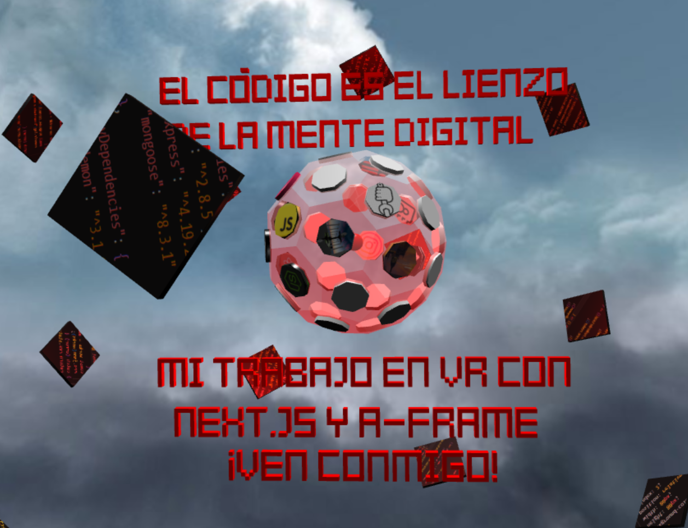
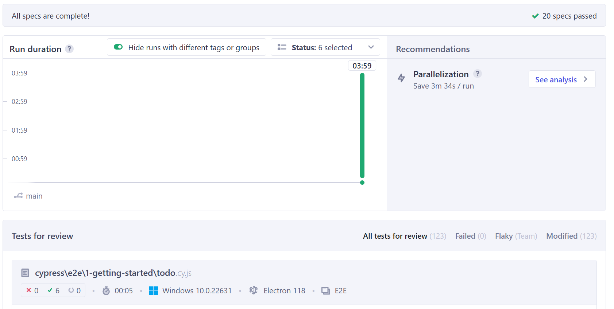
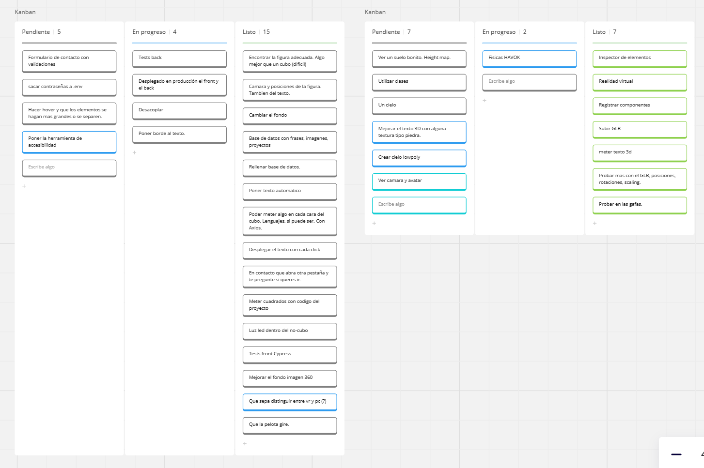

# Portfolio inmersivo y descripción

Este proyecto fue creado el dia 15-04-24 con `babylon.js`, `vite-react` y `node-express` y muestra las tecnologías que domino, las formas de contactar conmigo y los proyectos que he realizado. Cuando damos click en un proyecto o en una tecnología nos saldra una breve descripción o un link hacia ese proyecto. Tambien tenemos un apartado de texto 3D que nos muestra frases que identificarían mi filosofía de programación. Esto tendría una finalidad de conocerme mas allá de lo que se técnicamente.

La idea es seguir evolucionando el proyecto e ir incorporando diferentes funcionalidades que veremos mas adelante en el todo.

Actualmente se puede consultar en web y en las meta quest, aunque faltaría, además de desplegar el back, algun codigo referente a XR para que sea totalmente similar al funcionamiento en WEB.

No pude avanzar mas en este proyecto porque lo comencé algo tarde, pero me ha gustado explorar una nueva tecnologia de inmersivas WEB como lo es Babylon.js.
De todas formas, me ha gustado mucho experimentar y creo que es una idea bastante original para un portfolio, aunque queda mucho por pulir e intentaré ir puliendo poco a poco en mis tiempos libres. 

El objetivo final sería crear un boilerplate para que otras personas pudieran tener de guía o utilizarlo para enseñar sus trabajos.

## TODO
- ✅ Mobile device.
- ✅ Apto para VR
- ✅ Arc rotate camera y movimiento de la figura independientemente de la cámara.
- ✅ Axios get al back.
- ✅ Portfolio interactivo mediante clicks en las figuras.
- ✅ Test del front con Cypress
- ✅ Texto 3D.
- ❌ Cambiar la cámara a la VR Arc Rotate Camera.
- ❌ Que la figura gire en VR, ya que solo gira en WEB y en móvil.
- ❌ Havok Physics engine.
- ❌ Mejorar el diseño y cuidar los textos, ajustarlos.
- ❌ Terminar los tests del back.
- ❌ Atomic Design.
- ❌ Formulario con e-mail.
- ❌ Mayor interactividad, animaciones.
- ❌ Mejorar fondo, ya sea 360, skybox o panorámico.
- ❌ Crear un apartado sobre el proyecto mismo del portafolio para ofrecer información sobre él.

## Tecnologías Utilizadas

- Vite React
- Node Express js
- Babylon js
- Axios
- Cypress
- Vitest
- Mongoose
- Cors
- Javascript

## Instrucciones de Uso

1. Clona este repositorio.
2. Ejecuta `npm install` para instalar las dependencias en el lado del servidor y del cliente, en ambos..
3. Ejecuta `nodemon src/index.js` para ejecutar el servidor.
4. Ejecuta `npm run dev` para ejecutar el lado del cliente.

## Capturas de Pantalla

## Contribuciones

Las contribuciones son bienvenidas. Si encuentras algún error o tienes una mejora, ¡siéntete libre de abrir un problema o enviar un pull request!

## Estado del Proyecto

## Licencia

Este proyecto está bajo la licencia [MIT](LICENSE).

